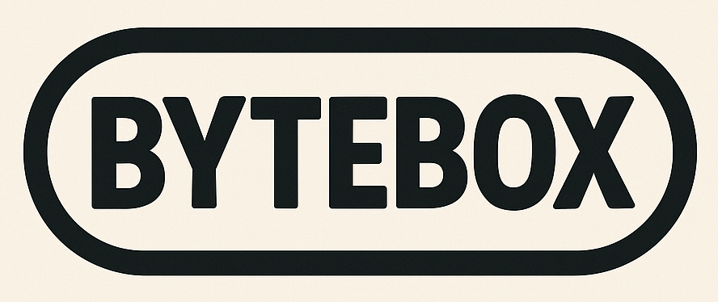

# ByteBox



**ByteBox** is a project based on the idea of a fantasy console designed for creating "old school" video games.

The project aims to inspire creativity by interacting with "hardware" (actually virtualized) through memory-mapped communication.

## Directories

- **console**: contains the WASM runtime. It's the "console" that runs in a web browser.
- **demos**: contains example games and templates from different languages to compile to **WASM**.
- **src**: optionally contains a game's source code.

## Platform

The idea behind using **WASM** as the target architecture is that it allows using different programming languages to achieve a common goal: _programming and having fun_.

Developers can create games using languages that are over 50 years old like _C_, or more modern ones like _Rust_.

### Runtime

The runtime uses vanilla _JavaScript_ in less than 1000 lines of code. The goal is not extensibility or modularity, but rather a simple, minimalist implementation without overhead.

An equally simple memory viewer is also available. Users can access it using the `F8` key.

### Examples

#### Games

Along with the project, some simple prototype games already compiled are supplied.

#### Templates

Also, the project provides several simple termplate examples in different programming languages. Additionally, developers can use any language that compiles to standard wasm-wasi _(without runtimes)_.

To run any of these examples, copy the template example's content into the `src/` folder and execute the compilation command corresponding to the programming language used _(see Useful Commands)_.

## Features/Limitations

- 8-bit architecture - _little endian_.
- 64KB of memory.
- 160x144 pixel display.
- 4-color RGB palette.
- Linear framebuffer (2 bits per pixel).
- 2 controller pads with 6 buttons each.
- 4 audio channels.
- Compiled games should not exceed 56KB.
- No predefined functions for playing sounds or drawing sprites. Only memory read/write operations are available.
- No reset button.

### Notes on Design Decisions

> About the game size limitation: 56KB might seem small, but these constraints enable significant creativity. The limitation is not blocking since young developers might benefit from enabling debugging options that quickly exceed the desired limit. However, games exceeding this size display a red indicator on the screen 🫣.

> About the absence of graphics functions: implementing custom sprite movement, gravity, parallax procedures, and similar features provides an excellent learning opportunity 🧠.

> About screen resolution and colors: these values match the Game Boy specifications. However, major differences exist since colors are customizable and the console uses a framebuffer rather than a tile and attribute system.

> About the controller pads: having only two main buttons is one of the most important and deliberate limitations. Some doubts remain about this decision, but fortunately 2 bits are available in case reconsideration becomes necessary in the future.

> About reserving space for RAM and Stack responds to a possible dual use with assembler _(MOS 6502, Zilog 80, etc)_.

## Functions

The **WASM** interaction _API_ is minimal and consists of 2 exportable functions and 3 importable functions.

### Exportable

- `init()`: Executes once when the game starts. This function typically initializes game values and configurations. This function has no input arguments or return values. Its use is optional and implementation/export is not mandatory.
- `update()`: Executes 60 times per second within the game loop. This function has no input arguments or return values. Its implementation and export is mandatory.

### Importable

- `peek(addr) -> value`: Retrieves the value from a memory address.
- `poke(addr, value)`: Sets a value at a memory address.
- `trace(str, len)`: Outputs a log message. Since WASM shares memory to work with complex data types (like strings), the message length must be specified.

## Memory Map

**ByteBox**'s memory map consists of a linear 64KB memory. It operates on an 8-bit architecture so each memory address can store one byte. Memory addressing is 16-bit (0x0000 to 0xFFFF).

### Detail

| Range | Size | Description |
|-------|------|-------------|
| `0x0000-0x003F` | 64 bytes | Reserved (future use) |
| `0x0040` | 1 byte | System flags |
| `0x0041` | 1 byte | Seed for random numbers |
| `0x0042-0x0043` | 2 bytes | Reserved (future use) |
| `0x0044-0x005B` | 24 bytes | Game name |
| `0x005C-0x00FF` | 191 bytes | Reserved (future use) |
| `0x0100-0xE0FF` | 57,344 bytes | Game ROM |
| `0xE100-0xE4FF` | 1,024 bytes | Write RAM |
| `0xE500-0xE8FF` | 1,024 bytes | Reserved for RAM + Stack (future use) |
| `0xE900-0xFF7F` | 5,760 bytes | Video framebuffer |
| `0xFF80-0xFF83` | 4 bytes | Reserved (future use) |
| `0xFF84-0xFF8F` | 12 bytes | Color palette |
| `0xFF90-0xFF93` | 4 bytes | Reserved (future use) |
| `0xFF94-0xFF95` | 2 bytes | Controller pads |
| `0xFF96` | 1 byte | Reserved (future use) |
| `0xFF97` | 1 byte | Audio channel status |
| `0xFF98-0xFFA7` | 16 bytes | SFX Audio channels |
| `0xFFA8-0xFFFF` | 88 bytes | Reserved (future use) |

> The design deliberately avoids direct memory sharing with **WASM** in favor of peek/poke functions. This abstraction layer provides better encapsulation, allows for memory access logging and validation, prevents potential buffer overflows, and gives the runtime more flexibility in memory management without exposing low-level implementation details to the game code.

### System Flags

Address `0x0040` _(1 byte)_ sets system flags. Bit representation:

```txt
7 6 5 4 3 2 1 0
│ │ │ │ │ │ │ │
│ │ │ │ │ │ │ └ HALT/RESUME
│ │ │ │ │ │ └── DUMP WRAM
└ └ └ └ └ └──── unused
```

- **Halt/Resume**: when the bit is set to 1, game loop execution stops _(rendering continues)_. When the bit value is 0, the game loop continues executing.
- **Dump WRAM**: when the bit is set to 1, WRAM is dumping into the cartridge _(local storage is actually used)_. When the dump is finished, the bit is automatically set to 0.

### Seed

Address `0x0041` _(1 byte)_ sets a pseudo-random value. This is useful for generating random numbers.

### Game Name

Addresses from `0x0044` to `0x005B` _(24 bytes)_ store the ASCII game name.

### ROM Game

Addresses from `0x0100` to `0xE0FF` _(57344 bytes)_ stores the read-only ROM game.

### WRAM

Addresses from `0xE100` to `0xE4FF` _(1024 bytes)_ stores writable RAM.

This memory can be dumped into the game cartridge _(see system flags)_. The console automatically reloads it when you start the game.

### Video Framebuffer

Addresses from `0xE900` to `0xFF7F` _(5760 bytes)_ stores the linear video framebuffer. Screen resolution is 160px by 144px and each framebuffer byte represents 4 pixels _(2 bits per pixel)_.

Within each byte, pixels are stored in **MSB first** order:

```txt
7 6 5 4 3 2 1 0
│ │ │ │ │ │ │ │
│ │ │ │ │ │ └ └ PIXEL 4
│ │ │ │ └ └──── PIXEL 3
│ │ └ └──────── PIXEL 2
└ └──────────── PIXEL 1
```

### Color Palette

Addresses from `0xFF84` to `0xFF8F` _(12 bytes)_ set the RGB values of the color palette. Each color uses 3 bytes to represent the _red_, _green_ and _blue_ values.

The default color palette is:

- **Color 1**: RGB(15, 15, 27)
- **Color 2**: RGB(86, 90, 117)
- **Color 3**: RGB(198, 183, 190)
- **Color 4**: RGB(250, 251, 246)

### Controller Pads

Addresses `0xFF94` and `0xFF95` _(2 bytes)_ provide read-only access to controller pads _(joystick)_ 1 and 2 respectively. Bit representation:

```txt
7 6 5 4 3 2 1 0
│ │ │ │ │ │ │ │
│ │ │ │ │ │ │ └ BUTTON B
│ │ │ │ │ │ └── BUTTON A
│ │ │ │ └ └──── unused
│ │ │ └──────── RIGHT
│ │ └────────── DOWN
│ └──────────── UP
└────────────── LEFT
```

Controller keys:

- **Pad 1**:
  - Direction: `arrow` keys.
  - Button A: `Z` key. Alternatively, the `multiply` key on the numeric pad can be used.
  - Button B: `X` key. Alternatively, the `subtract` key on the numeric pad can be used.
- **Pad 2**:
  - Direction: `A`, `W`, `D`, `S` keys.
  - Button A: `K` key.
  - Button B: `L` key.

### SFX Channel Status

Address `0xFF97` _(1 byte)_ provides read-only status of all sound channels. Bit representation:

```txt
7 6 5 4 3 2 1 0
│ │ │ │ │ │ │ │
│ │ │ │ │ │ │ └ SFX CHANNEL 0
│ │ │ │ │ │ └── SFX CHANNEL 1
│ │ │ │ │ └──── SFX CHANNEL 2
│ │ │ │ └────── SFX CHANNEL 3
└ └ └ └──────── unused
```

Bit 1 = channel playing, bit 0 = channel free.

### Sound and Effects

Addresses from `0xFF98` to `0xFFA7` _(16 bytes)_ handle the 4 available sound effects channels. Each channel uses 4 bytes for sound effect generation.

#### Sound Data Structure

Each 4-byte sound effect is structured as follows:

- **Byte 0**:

```txt
7 6 5 4 3 2 1 0
│ │ │ │ │ │ │ │
└ └ └ └ └ └ └ └ INITIAL FREQUENCY: (0-255 -> 20-1000 Hz)
```

- **Byte 1**:

```txt
7 6 5 4 3 2 1 0
│ │ │ │ │ │ │ │
└ └ └ └ └ └ └ └ ENDING FREQUENCY: (0-255 -> 20-1000 Hz)
```

- **Byte 2**:

```txt
7 6 5 4 3 2 1 0
│ │ │ │ │ │ │ │ 
│ │ │ │ │ └ └ └ VOLUME: (0-7)
└ └ └ └ └────── DURATION: (0-31 -> 0.03s 0.99s)
```

- **Byte 3**:

```txt
7 6 5 4 3 2 1 0
│ │ │ │ │ │ │ │
│ │ │ │ │ │ │ └ TRIGGER: set 1 to start play
│ │ │ │ │ └ └── unused
│ │ │ └ └────── WAVEFORM: (0-3)
└ └ └────────── VIBRATO: (0-7)
```

**Important**: The runtime automatically clears the `trigger` bit after reading it.
To play the same sound again, you must set the trigger bit to 1 again.
A channel cannot play a new sound while a previous sound is still playing on that channel.

##### Waveforms

4 available waveforms _(2 bits)_:

- **0**: sine.
- **1**: sawtooth.
- **2**: squeare.
- **3**: triangle.

## Useful Commands

Only **Docker** and **make** need to be installed to run any command.

### Compile a Game

Game source files must be located inside `src/` folder.

To compile a game written in _C_, run:

```sh
make build-c
```

To compile a game written in _Go_, run:

```sh
make build-go
```

To compile a game written in _Rust_, run:

```sh
make build-rust
```

To compile a game written in _Zig_, run:

```sh
make build-zig
```

### Run the Console on a Local Web Server

```sh
make run
```

This starts a local webserver on port `3000`. To start on a different port, set an environment variable as follows:

```sh
PORT=8080 make run
```

## Inspiration

**ByteBox** is far from being a complete fantasy console as that's not the goal. If you're looking for mature and recognized projects, we recommend:

- [PICO-8](https://www.lexaloffle.com/pico-8.php)
- [TIC-80](https://tic80.com/)
- [WASM4](https://wasm4.org/)

## Next Steps / Ideas

The decision for the memory map layout and reserving certain addresses for future use considers compatibility with 3 classic processors from the _70s/80s_: the **MOS 6502**, **Intel 8080**, and **Zilog Z80**. Eventually in the future, the runtime could also process assembly code for any of these processors.

An interesting cartridge project could support embedded languages like **lua** by including its virtual machine within the cartridge. A game that allows running games?

## License

This project is distributed under the following [license](LICENSE).
