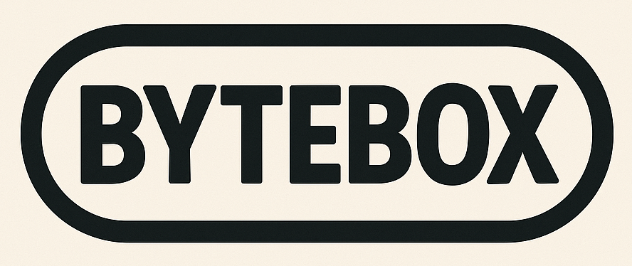

# ByteBox



[English](README.md) | [Español](README.es.md) | **Português**

[](LICENSE)
[](https://github.com/danielspk/bytebox-wasm/tags)
[](https://github.com/danielspk/bytebox-wasm/tree/main/demos/templates)
[](https://webassembly.org/)

**ByteBox** é um projeto baseado na ideia de um console de fantasia projetado para criar videogames "old school".

O projeto busca inspirar a criatividade por meio da interação com "hardware" _(na verdade virtualizado)_ através de comunicação mapeada em memória.

## Diretórios

- **console**: contém o runtime WASM. É o "console" que roda em um navegador web.
- **demos**: contém jogos de exemplo e templates de diferentes linguagens para compilar para **WASM**.
- **src**: opcionalmente contém o código-fonte de um jogo.

## Plataforma

A ideia por trás de usar **WASM** como arquitetura-alvo é que ela permite empregar diferentes linguagens de programação para alcançar um objetivo comum: _programar e se divertir_.

Os desenvolvedores podem criar jogos usando linguagens com mais de 50 anos de idade como _C_, ou outras mais modernas como _Rust_.

> A compilação deve usar **WASM** puro, sem dependências de **WASI**.

### Runtime

O runtime usa _JavaScript_ vanilla em menos de 1000 linhas de código. O objetivo não é a extensibilidade nem a modularidade, mas sim uma implementação simples e minimalista, sem overhead.

Também há disponível um visualizador de memória igualmente simples. Os usuários podem acessá-lo com a tecla `F8`.

### Exemplos

#### Jogos

Junto com o projeto, são incluídos alguns jogos protótipo simples já compilados.

#### Templates

Além disso, o projeto fornece vários exemplos de template simples em diferentes linguagens de programação. Adicionalmente, os desenvolvedores podem usar qualquer linguagem que compile para wasm padrão _(sem runtimes)_.

Para executar qualquer um desses exemplos, copie o conteúdo do template de exemplo dentro da pasta `src/` e execute o comando de compilação correspondente à linguagem de programação usada _(ver Comandos Úteis)_.

## Características/Limitações

- Arquitetura de 8 bits - _little endian_.
- 64KB de memória.
- Display de 160x120 pixels.
- Paleta RGB de 4 cores.
- Framebuffer linear (2 bits por pixel).
- 2 controles (pads) com 6 botões cada um.
- 4 canais de áudio.
- Os jogos compilados não devem ultrapassar 56KB.
- Sem funções predefinidas para reproduzir sons ou desenhar sprites. Apenas operações de leitura/escrita em memória estão disponíveis.
- Sem botão de reset.

### Notas sobre Decisões de Design

> Sobre a limitação de tamanho do jogo: 56KB pode parecer pouco, mas essas restrições habilitam uma criatividade significativa. A limitação não é bloqueante, já que desenvolvedores jovens podem se beneficiar ao habilitar opções de debugging que rapidamente ultrapassam o limite desejado. No entanto, os jogos que ultrapassam esse tamanho exibem um indicador vermelho na tela 🫣.

> Sobre a ausência de funções gráficas: implementar movimento de sprites personalizado, gravidade, procedimentos de parallax e recursos similares oferece uma excelente oportunidade de aprendizado 🧠.

> Sobre a resolução de tela e as cores: buscamos uma resolução com a clássica proporção 4:3 e medidas similares às do Game Boy. Da mesma forma, é possível representar 4 cores distintas como no Game Boy, mas com diferenças importantes, já que as cores são personalizáveis e o console usa um framebuffer em vez de um sistema de tiles e atributos.

> Sobre os controles (pads): ter apenas dois botões principais é uma das limitações mais importantes e deliberadas. Restam algumas dúvidas sobre essa decisão, mas felizmente há 2 bits disponíveis caso seja necessário reconsiderá-la no futuro.

> Sobre reservar espaço para a RAM e o Stack: atende a um possível uso dual com assembler _(MOS 6502, Zilog 80, etc)_.

## Funções

A _API_ de interação com **WASM** é mínima e consiste em 2 funções exportáveis e 4 importáveis.

### Exportáveis

- `init()`: Executa uma vez quando o jogo inicia. Essa função tipicamente inicializa valores e configurações do jogo. Não tem argumentos de entrada nem valores de retorno. Seu uso é opcional e sua implementação/exportação não é obrigatória.
- `update()`: Executa 60 vezes por segundo dentro do game loop. Não tem argumentos de entrada nem valores de retorno. Sua implementação e exportação é obrigatória.

### Importáveis

- `peek(addr) -> value`: Obtém o valor de um endereço de memória.
- `poke(addr, value)`: Define um valor em um endereço de memória.
- `spoke(start_addr, length, data)`: _super poke_, escreve múltiplos bytes na memória em uma única chamada.
- `trace(str, len)`: Emite uma mensagem de log. Como o WASM compartilha memória para trabalhar com tipos de dados complexos _(como strings)_, o comprimento da mensagem deve ser especificado.

## Mapa de Memória

O mapa de memória do **ByteBox** consiste em uma memória linear de 64KB. Opera sobre uma arquitetura de 8 bits, portanto cada endereço de memória pode armazenar um byte. O endereçamento de memória é de 16 bits (0x0000 a 0xFFFF).

### Detalhe

| Faixa | Tamanho | Descrição |
|-------|---------|-----------|
| `0x0000-0x003F` | 64 bytes | Reservado (uso futuro) |
| `0x0040` | 1 byte | Flags de sistema |
| `0x0041` | 1 byte | Semente para números aleatórios |
| `0x0042-0x0043` | 2 bytes | Reservado (uso futuro) |
| `0x0044-0x005B` | 24 bytes | Nome do jogo |
| `0x005C-0x00FF` | 164 bytes | Reservado (uso futuro) |
| `0x0100-0xE0FF` | 57.344 bytes | ROM do jogo |
| `0xE100-0xE4FF` | 1.024 bytes | RAM de escrita |
| `0xE500-0xE8FF` | 1.024 bytes | Reservado para RAM + Stack (uso futuro) |
| `0xE900-0xFBBF` | 4.800 bytes | Framebuffer de vídeo |
| `0xFBC0-0xFF83` | 964 bytes | Reservado (uso futuro) |
| `0xFF84-0xFF8F` | 12 bytes | Paleta de cores |
| `0xFF90-0xFF93` | 4 bytes | Reservado (uso futuro) |
| `0xFF94-0xFF95` | 2 bytes | Controles (pads) |
| `0xFF96` | 1 byte | Reservado (uso futuro) |
| `0xFF97` | 1 byte | Status dos canais SFX |
| `0xFF98-0xFFA7` | 16 bytes | Canais SFX |
| `0xFFA8` | 1 byte | Atributos de melodia |
| `0xFFA9-0xFFE8` | 64 bytes | Ring buffer de melodia |
| `0xFFE9-0xFFEA` | 2 bytes | Ponteiros de melodia |
| `0xFFEB-0xFFFF` | 21 bytes | Reservado (uso futuro) |

> O design evita deliberadamente compartilhar memória diretamente com **WASM** em favor das funções peek/poke. Essa camada de abstração fornece melhor encapsulamento, permite o logging e a validação de acessos à memória, previne possíveis buffer overflows e dá ao runtime mais flexibilidade na gestão de memória sem expor detalhes de implementação de baixo nível ao código do jogo.

### Flags de Sistema

O endereço `0x0040` _(1 byte)_ define os flags de sistema. Representação de bits:

```txt
7 6 5 4 3 2 1 0
│ │ │ │ │ │ │ │
│ │ │ │ │ │ │ └ HALT/RESUME
│ │ │ │ │ │ └── DUMP WRAM
└─└─└─└─└─└──── não usado
```

- **Halt/Resume**: quando o bit está em 1, a execução do game loop é interrompida _(a renderização continua)_. Quando o bit vale 0, o game loop continua executando.
- **Dump WRAM**: quando o bit está em 1, a WRAM é despejada no cartucho _(na verdade, usa-se local storage)_. Quando o despejo termina, o bit é automaticamente definido em 0.

### Semente

O endereço `0x0041` _(1 byte)_ define um valor pseudoaleatório. Isso é útil para gerar números aleatórios.

### Nome do Jogo

Os endereços de `0x0044` a `0x005B` _(24 bytes)_ armazenam o nome do jogo em ASCII.

### ROM do Jogo

Os endereços de `0x0100` a `0xE0FF` _(57344 bytes)_ armazenam a ROM somente leitura do jogo.

### WRAM

Os endereços de `0xE100` a `0xE4FF` _(1024 bytes)_ armazenam a RAM de escrita.

Essa memória pode ser despejada no cartucho do jogo _(ver flags de sistema)_. O console a recarrega automaticamente quando você inicia o jogo.

### Framebuffer de Vídeo

Os endereços de `0xE900` a `0xFBBF` _(4800 bytes)_ armazenam o framebuffer de vídeo linear. A resolução de tela é de 160px por 120px e cada byte do framebuffer representa 4 pixels _(2 bits por pixel)_.

Dentro de cada byte, os pixels são armazenados em ordem **MSB first**:

```txt
7 6 5 4 3 2 1 0
│ │ │ │ │ │ │ │
│ │ │ │ │ │ └─└ PIXEL 4
│ │ │ │ └─└──── PIXEL 3
│ │ └─└──────── PIXEL 2
└─└──────────── PIXEL 1
```

### Paleta de Cores

Os endereços de `0xFF84` a `0xFF8F` _(12 bytes)_ definem os valores RGB da paleta de cores. Cada cor usa 3 bytes para representar os valores de _vermelho_, _verde_ e _azul_.

A paleta de cores padrão é:

- **Cor 1**: RGB(15, 15, 27)
- **Cor 2**: RGB(86, 90, 117)
- **Cor 3**: RGB(198, 183, 190)
- **Cor 4**: RGB(250, 251, 246)

### Controles (Pads)

Os endereços `0xFF94` e `0xFF95` _(2 bytes)_ fornecem acesso somente leitura aos controles (joysticks) 1 e 2 respectivamente. Representação de bits:

```txt
7 6 5 4 3 2 1 0
│ │ │ │ │ │ │ │
│ │ │ │ │ │ │ └ BOTÃO B
│ │ │ │ │ │ └── BOTÃO A
│ │ │ │ └─└──── não usado
│ │ │ └──────── DIREITA
│ │ └────────── BAIXO
│ └──────────── CIMA
└────────────── ESQUERDA
```

Teclas dos controles:

- **Pad 1**:
  - Direção: teclas de `seta`.
  - Botão A: tecla `Z`. Alternativamente, pode-se usar a tecla de `multiplicação` do teclado numérico.
  - Botão B: tecla `X`. Alternativamente, pode-se usar a tecla de `subtração` do teclado numérico.
- **Pad 2**:
  - Direção: teclas `A`, `W`, `D`, `S`.
  - Botão A: tecla `K`.
  - Botão B: tecla `L`.

### Status dos Canais de Efeitos Sonoros

O endereço `0xFF97` _(1 byte)_ fornece o status somente leitura de todos os canais de som. Representação de bits:

```txt
7 6 5 4 3 2 1 0
│ │ │ │ │ │ │ │
│ │ │ │ │ │ │ └ CANAL SFX 0
│ │ │ │ │ │ └── CANAL SFX 1
│ │ │ │ │ └──── CANAL SFX 2
│ │ │ │ └────── CANAL SFX 3
└─└─└─└──────── não usado
```

Bit em 1 = canal reproduzindo, bit em 0 = canal livre.

### Canais de Efeitos Sonoros

Os endereços de `0xFF98` a `0xFFA7` _(16 bytes)_ gerenciam os 4 canais de efeitos sonoros disponíveis. Cada canal usa 4 bytes para a geração de efeitos sonoros.

#### Estrutura de Dados

Cada efeito sonoro de 4 bytes é estruturado da seguinte forma:

- **Byte 0**:

```txt
7 6 5 4 3 2 1 0
│ │ │ │ │ │ │ │
└─└─└─└─└─└─└─└ FREQUÊNCIA INICIAL: (0-255 -> 20-1000 Hz)
```

- **Byte 1**:

```txt
7 6 5 4 3 2 1 0
│ │ │ │ │ │ │ │
└─└─└─└─└─└─└─└ FREQUÊNCIA FINAL: (0-255 -> 20-1000 Hz)
```

- **Byte 2**:

```txt
7 6 5 4 3 2 1 0
│ │ │ │ │ │ │ │ 
│ │ │ │ │ └─└─└ VOLUME: (0-7)
└─└─└─└─└────── DURAÇÃO: (0-31 -> 0.03s 0.99s)
```

- **Byte 3**:

```txt
7 6 5 4 3 2 1 0
│ │ │ │ │ │ │ │
│ │ │ │ │ │ │ └ TRIGGER: defina 1 para iniciar a reprodução
│ │ │ │ │ └─└── WAVEFORM: (0-3)
│ │ │ │ └────── não usado
│ └─└─└──────── VIBRATO: (0-7)
└────────────── não usado
```

**Importante**: O runtime limpa automaticamente o bit `trigger` após lê-lo.
Para reproduzir o mesmo som novamente, você deve definir o bit trigger em 1 outra vez.
Um canal não pode reproduzir um novo som enquanto um som anterior continuar tocando nesse canal.

##### Waveforms

4 waveforms disponíveis _(2 bits)_:

- **0**: senoidal.
- **1**: dente de serra.
- **2**: quadrada.
- **3**: triangular.

### Atributos de Melodia

O endereço `0xFFA8` _(1 byte)_ define o volume master do áudio de melodia. Representação de bits:

```txt
7 6 5 4 3 2 1 0
│ │ │ │ │ │ │ │
│ │ │ │ └─└─└─└ VOLUME: (0-15)
└─└─└─└──────── não usado
```

### Buffer de Melodia

Os endereços de `0xFFA9` a `0xFFE8` _(64 bytes)_ armazenam o ring buffer do áudio de melodia.

#### Protocolo FAB-4

Cada entrada de 4 bytes representa um evento de nota:

- **Byte 0**:

```txt
7 6 5 4 3 2 1 0
│ │ │ │ │ │ │ │
└─└─└─└─└─└─└─└ DELTA_HI: (ms)
```

- **Byte 1**:

```txt
7 6 5 4 3 2 1 0
│ │ │ │ │ │ │ │
└─└─└─└─└─└─└─└ DELTA_LO: (ms)
```

- **Byte 2**:

```txt
7 6 5 4 3 2 1 0
│ │ │ │ │ │ │ │
│ │ │ │ └─└─└─└ NOTA (0-127)
└─└─└─└──────── não usado
```

- **Byte 3**:

```txt
7 6 5 4 3 2 1 0
│ │ │ │ │ │ │ │
│ │ │ │ └─└─└─└ VOLUME: (0-15)
│ └─└─└──────── CANAL: (0-7)
└────────────── STATUS: (1: ON, 0: OFF)
```

### Ponteiros de Melodia

O endereço `0xFFE9` _(1 byte)_ define a cabeça _(produtor)_ do ring buffer do áudio de melodia.

O endereço `0xFFEA` _(1 byte)_ fornece acesso somente leitura à cauda _(consumidor)_ do ring buffer do áudio de melodia.

Ambos os endereços implementam um padrão _produtor-consumidor_: escreva em `0xFFE9` para enfileirar novas entradas de melodia; a APU avança `0xFFEA` conforme as consome.

## Parâmetros de URL

O console suporta parâmetros de query opcionais:

| Parâmetro | Exemplo | Descrição |
|-----------|---------|-----------|
| `color` | `?color=e74c3c` | Cor da moldura personalizada (hex de 6 dígitos, sem `#`) |
| `nosplash` | `?nosplash` | Pula a tela de splash ao iniciar |

Uso: `http://localhost:3000?color=3498db&nosplash`

## Comandos Úteis

Basta ter o **Docker** e o **make** instalados para executar qualquer comando.

### Compilar um Jogo

Os arquivos-fonte do jogo devem estar localizados dentro da pasta `src/`.

Para compilar um jogo escrito em _AssemblyScript_, execute:

```sh
make build-assemblyscript
```

Para compilar um jogo escrito em _C_, execute:

```sh
make build-c
```

Para compilar um jogo escrito em _C3_, execute:

```sh
make build-c3
```

Para compilar um jogo escrito em _D_, execute:

```sh
make build-d
```

Para compilar um jogo escrito em _Go_, execute:

```sh
make build-go
```

Para compilar um jogo escrito em _Nelua_, execute:

```sh
make build-nelua
```

Para compilar um jogo escrito em _Odin_, execute:

```sh
make build-odin
```

Para compilar um jogo escrito em _Rust_, execute:

```sh
make build-rust
```

Para compilar um jogo escrito em _Zig_, execute:

```sh
make build-zig
```

Para compilar um jogo escrito em _WebAssembly Text_, execute:

```sh
make build-wat
```

### Executar o Console em um Servidor Web Local

```sh
make run
```

Isso inicia um servidor web local na porta `3000`. Para iniciar em uma porta diferente, defina uma variável de ambiente da seguinte forma:

```sh
PORT=8080 make run
```

## Inspiração

**ByteBox** está longe de ser um console de fantasia completo, já que esse não é o objetivo. Se você procura projetos maduros e reconhecidos, recomendamos:

- [PICO-8](https://www.lexaloffle.com/pico-8.php)
- [TIC-80](https://tic80.com/)
- [WASM4](https://wasm4.org/)

## Próximos Passos / Ideias

A decisão sobre o layout do mapa de memória e a reserva de certos endereços para uso futuro considera a compatibilidade com 3 processadores clássicos dos anos _70/80_: o **MOS 6502**, o **Intel 8080** e o **Zilog Z80**. Eventualmente, no futuro, o runtime também poderá processar código assembly para qualquer um desses processadores.

## Licença

Este projeto é distribuído sob a seguinte [licença](LICENSE).
